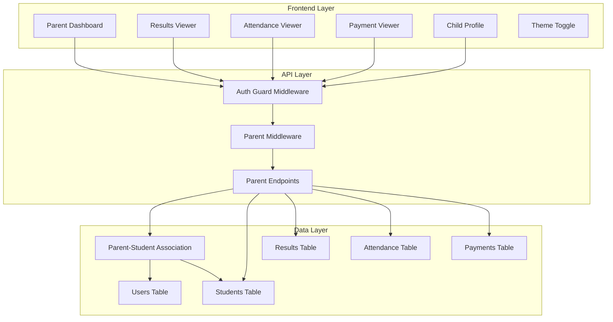
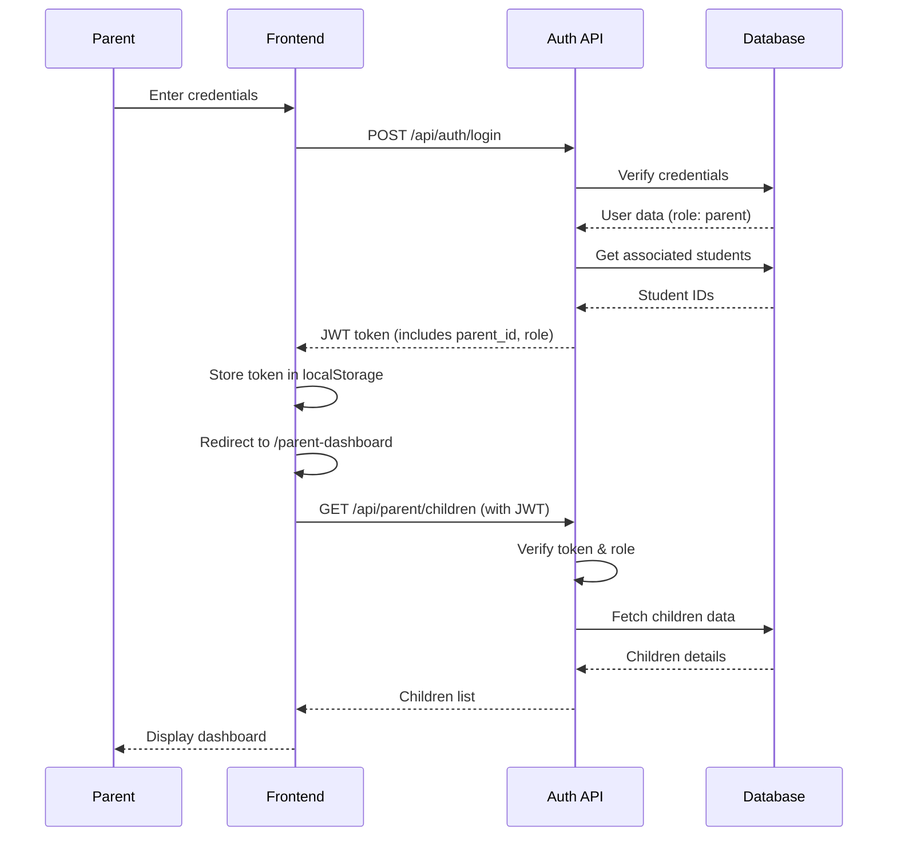
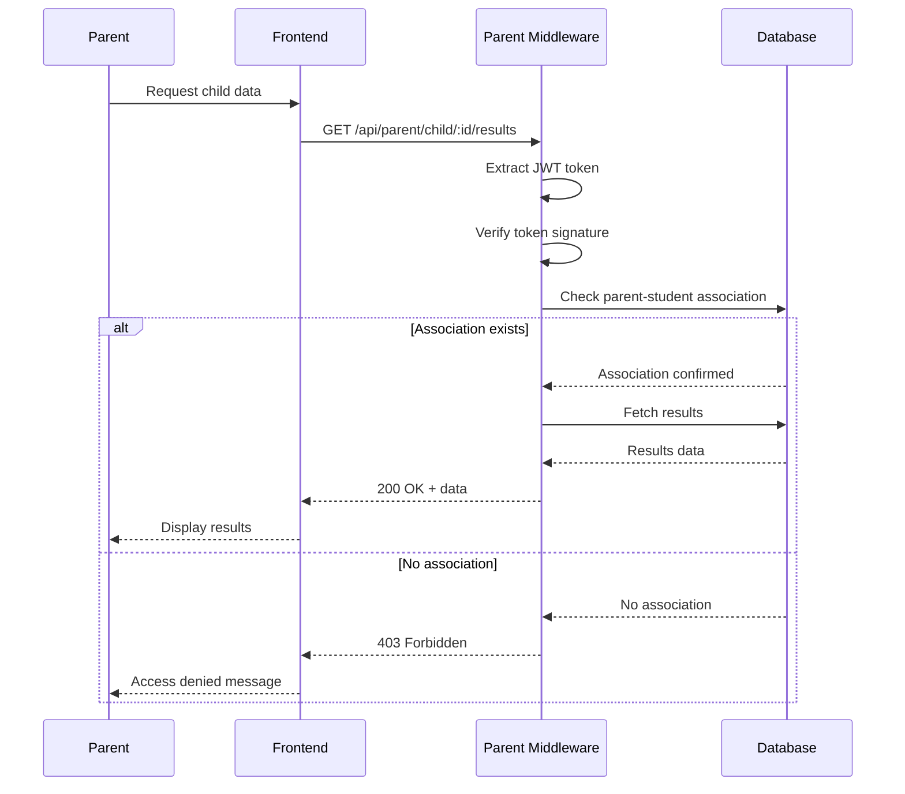

# Design Document: Parent Role Monitoring

## Overview

The Parent Role Monitoring feature extends the existing school management system to support a parent role with read-only access to their children's academic and administrative data. This feature integrates with the existing JWT-based authentication system and role-based access control to provide secure, isolated access for parents to view grades, attendance, payment status, and profile information for their associated children.

### Key Design Principles

- **Security First**: All parent access is validated through JWT tokens and parent-student associations
- **Read-Only Access**: Parents have no ability to modify any school data
- **Data Isolation**: Parents can only access data for their associated children
- **Multi-Child Support**: Parents with multiple children can switch between them seamlessly
- **Responsive Design**: The interface works across desktop and mobile devices
- **Theme Support**: Bright and dark mode with persistent user preferences

### Integration Points

- **Authentication System**: Extends existing JWT authentication to include parent role
- **Database**: Adds parent-student association table and updates existing schema
- **Frontend Routing**: Adds parent-specific routes with role-based guards
- **API Layer**: New endpoints for parent data access with authorization middleware

## Architecture

### System Architecture



### Authentication Flow



### Authorization Flow



## Components and Interfaces

### Backend Components

#### 1. Database Schema Changes

**New Table: parent_students**
```sql
CREATE TABLE IF NOT EXISTS parent_students (
    id INT AUTO_INCREMENT PRIMARY KEY,
    parent_id INT NOT NULL,
    student_id INT NOT NULL,
    relationship VARCHAR(50) DEFAULT 'parent',
    created_at TIMESTAMP DEFAULT CURRENT_TIMESTAMP,
    FOREIGN KEY (parent_id) REFERENCES users(id) ON DELETE CASCADE,
    FOREIGN KEY (student_id) REFERENCES students(id) ON DELETE CASCADE,
    UNIQUE KEY unique_parent_student (parent_id, student_id)
);
```

**Updated Table: students**
```sql
-- Add enrollment_date and section columns
ALTER TABLE students 
ADD COLUMN enrollment_date DATE DEFAULT NULL,
ADD COLUMN section VARCHAR(10) DEFAULT NULL;
```

**Note**: The `users` table already supports the 'parent' role in the ENUM definition.

#### 2. API Endpoints

**Authentication Endpoints** (extend existing)
- `POST /api/auth/register` - Register parent account (admin or self-registration)
- `POST /api/auth/login` - Parent login (returns JWT with parent_id)
- `POST /api/auth/change-password` - Change password (requires current password)

**Parent-Specific Endpoints** (new)
- `GET /api/parent/children` - Get all children for logged-in parent
- `GET /api/parent/child/:studentId/profile` - Get child's profile information
- `GET /api/parent/child/:studentId/results` - Get child's academic results
- `GET /api/parent/child/:studentId/attendance` - Get child's attendance records
- `GET /api/parent/child/:studentId/payments` - Get child's payment history

**Admin Endpoints** (extend existing)
- `POST /api/admin/parent` - Create parent account and associations
- `POST /api/admin/parent/:parentId/link-student` - Link student to parent
- `DELETE /api/admin/parent/:parentId/unlink-student/:studentId` - Unlink student

#### 3. Middleware Components

**parentAuthMiddleware.js**
```javascript
// Verifies JWT token and checks for parent role
const parentAuthMiddleware = (req, res, next) => {
  // Extract and verify JWT token
  // Check if role === 'parent'
  // Attach user info to req.user
  // Call next() or return 403
};
```

**parentStudentMiddleware.js**
```javascript
// Verifies parent-student association
const parentStudentMiddleware = async (req, res, next) => {
  // Extract parent_id from req.user
  // Extract student_id from req.params
  // Query parent_students table
  // Call next() if association exists, else return 403
};
```

#### 4. Controller Functions

**parentController.js**
- `getChildren(req, res)` - Fetch all children for parent
- `getChildProfile(req, res)` - Fetch child profile details
- `getChildResults(req, res)` - Fetch child's grades
- `getChildAttendance(req, res)` - Fetch child's attendance
- `getChildPayments(req, res)` - Fetch child's payment history

### Frontend Components

#### 1. ParentDashboard Component

**Location**: `frontend/src/pages/ParentDashboard.jsx`

**Features**:
- Welcome message with parent name (yellow color #FFD700)
- Theme toggle button (bright/dark mode)
- Child selector dropdown (for multi-child support)
- Summary cards for each child showing:
  - Name, class, section
  - Attendance percentage
  - Average grade
  - Payment status
- Navigation cards to:
  - Child Profile
  - Results
  - Attendance
  - Payments

**State Management**:
```javascript
const [children, setChildren] = useState([]);
const [selectedChild, setSelectedChild] = useState(null);
const [theme, setTheme] = useState('bright'); // 'bright' or 'dark'
const [loading, setLoading] = useState(true);
```

#### 2. ChildSelector Component

**Location**: `frontend/src/components/ChildSelector.jsx`

**Props**:
- `children`: Array of child objects
- `selectedChild`: Currently selected child
- `onSelectChild`: Callback function

**Features**:
- Dropdown menu with child names
- Automatically hidden if only one child
- Persists selection in sessionStorage

#### 3. ResultsViewer Component

**Location**: `frontend/src/pages/ParentResultsPage.jsx`

**Features**:
- Display all subjects with grades
- Show subject name, marks, grade, total score
- Calculate and display average
- Show pass/fail status
- Read-only table (no edit controls)
- Filter by term/semester (if applicable)

**Data Structure**:
```javascript
{
  studentId: 123,
  studentName: "Alex Johnson",
  results: [
    {
      subject: "Mathematics",
      marks: 92,
      totalMarks: 100,
      grade: "A",
      status: "Pass"
    },
    // ...
  ],
  average: 88.5,
  overallStatus: "Pass"
}
```

#### 4. AttendanceViewer Component

**Location**: `frontend/src/pages/ParentAttendancePage.jsx`

**Features**:
- Display attendance records by date
- Show Present/Absent status
- Calculate and display:
  - Total present days
  - Total absent days
  - Attendance percentage
- Date range selector (default: last 30 days)
- Calendar view option

**Calculation**:
```javascript
attendancePercentage = (presentDays / totalDays) * 100
```

#### 5. PaymentViewer Component

**Location**: `frontend/src/pages/ParentPaymentsPage.jsx`

**Features**:
- Display payment history
- Show payment date, amount (ETB), status
- Calculate and display:
  - Total fees
  - Total paid
  - Remaining balance
- Payment status indicators (Paid/Pending)
- Download receipt option (if available)

**Calculation**:
```javascript
remainingFees = totalFees - paidFees
```

#### 6. ChildProfile Component

**Location**: `frontend/src/pages/ParentChildProfilePage.jsx`

**Features**:
- Display child's profile information:
  - Student ID
  - Full name
  - Class and section
  - Enrollment date
  - Age
  - Parent contact (phone)
- Display assigned teachers with contact info
- Read-only format (no edit controls)

#### 7. ThemeToggle Component

**Location**: `frontend/src/components/ThemeToggle.jsx`

**Features**:
- Toggle button for bright/dark mode
- Icon changes based on theme (sun/moon)
- Persists preference in localStorage
- Applies CSS variables for theme

**Theme Variables**:
```css
/* Bright Mode */
--bg-primary: #FFFFFF;
--bg-secondary: #F5F5F5;
--text-primary: #1A1A1A;
--text-secondary: #666666;
--welcome-color: #FFD700;

/* Dark Mode */
--bg-primary: #1A1A1A;
--bg-secondary: #2A2A2A;
--text-primary: #FFFFFF;
--text-secondary: #CCCCCC;
--welcome-color: #FFD700;
```

### Frontend Routing

**Route Configuration** (`frontend/src/App.jsx`)

```javascript
// Protected parent routes
<Route path="/parent-dashboard" element={
  <ProtectedRoute allowedRoles={['parent']}>
    <ParentDashboard />
  </ProtectedRoute>
} />

<Route path="/parent/child-profile" element={
  <ProtectedRoute allowedRoles={['parent']}>
    <ParentChildProfilePage />
  </ProtectedRoute>
} />

<Route path="/parent/results" element={
  <ProtectedRoute allowedRoles={['parent']}>
    <ParentResultsPage />
  </ProtectedRoute>
} />

<Route path="/parent/attendance" element={
  <ProtectedRoute allowedRoles={['parent']}>
    <ParentAttendancePage />
  </ProtectedRoute>
} />

<Route path="/parent/payments" element={
  <ProtectedRoute allowedRoles={['parent']}>
    <ParentPaymentsPage />
  </ProtectedRoute>
} />
```

**ProtectedRoute Component**

```javascript
const ProtectedRoute = ({ children, allowedRoles }) => {
  const token = localStorage.getItem('token');
  
  if (!token) {
    return <Navigate to="/login" />;
  }
  
  const decoded = jwtDecode(token);
  
  // Check token expiration
  if (decoded.exp * 1000 < Date.now()) {
    localStorage.removeItem('token');
    return <Navigate to="/login" />;
  }
  
  // Check role authorization
  if (!allowedRoles.includes(decoded.role)) {
    return <Navigate to="/access-denied" />;
  }
  
  return children;
};
```

## Data Models

### User Model (Extended)

```javascript
{
  id: Integer,
  username: String,
  email: String,
  password_hash: String,
  role: Enum['student', 'teacher', 'admin', 'parent'],
  must_change_password: Boolean,
  failed_attempts: Integer,
  locked_at: Timestamp,
  created_at: Timestamp
}
```

### Parent-Student Association Model

```javascript
{
  id: Integer,
  parent_id: Integer, // FK to users.id
  student_id: Integer, // FK to students.id
  relationship: String, // 'parent', 'guardian', etc.
  created_at: Timestamp
}
```

### Student Model (Extended)

```javascript
{
  id: Integer,
  student_id: String, // Unique identifier
  user_id: Integer, // FK to users.id
  name: String,
  class: String,
  section: String, // NEW
  age: Integer,
  parent_phone: String,
  enrollment_date: Date, // NEW
  temp_password: String,
  is_registered: Boolean
}
```

### Result Model

```javascript
{
  id: Integer,
  student_id: Integer, // FK to students.id
  subject: String,
  marks: Integer,
  total_marks: Integer, // Optional, default 100
  grade: String, // Calculated
  term: String, // Optional
  academic_year: String // Optional
}
```

### Attendance Model

```javascript
{
  id: Integer,
  student_id: Integer, // FK to students.id
  date: Date,
  status: Enum['Present', 'Absent']
}
```

### Payment Model

```javascript
{
  id: Integer,
  student_id: Integer, // FK to students.id
  amount: Decimal,
  date: Date,
  status: Enum['Paid', 'Pending'],
  description: String, // Optional
  receipt_number: String // Optional
}
```

### API Response Models

**Children List Response**
```javascript
{
  success: true,
  children: [
    {
      id: 1,
      student_id: "STU-001",
      name: "Alex Johnson",
      class: "Grade 10",
      section: "B",
      enrollment_date: "2023-09-01",
      summary: {
        attendance_percentage: 96,
        average_grade: "A-",
        payment_status: "Paid"
      }
    }
  ]
}
```

**Child Results Response**
```javascript
{
  success: true,
  student: {
    id: 1,
    name: "Alex Johnson",
    class: "Grade 10",
    section: "B"
  },
  results: [
    {
      subject: "Mathematics",
      marks: 92,
      total_marks: 100,
      grade: "A",
      status: "Pass"
    }
  ],
  statistics: {
    average: 88.5,
    total_subjects: 8,
    passed: 8,
    failed: 0
  }
}
```

**Child Attendance Response**
```javascript
{
  success: true,
  student: {
    id: 1,
    name: "Alex Johnson"
  },
  attendance: [
    {
      date: "2024-03-01",
      status: "Present"
    }
  ],
  statistics: {
    total_days: 180,
    present_days: 173,
    absent_days: 7,
    percentage: 96.11
  }
}
```

**Child Payments Response**
```javascript
{
  success: true,
  student: {
    id: 1,
    name: "Alex Johnson"
  },
  payments: [
    {
      id: 1,
      date: "2024-01-15",
      amount: 5000.00,
      status: "Paid",
      description: "Tuition Fee - Term 1",
      receipt_number: "RCP-2024-001"
    }
  ],
  summary: {
    total_fees: 20000.00,
    paid_fees: 15000.00,
    remaining_fees: 5000.00,
    currency: "ETB"
  }
}
```


## Correctness Properties

*A property is a characteristic or behavior that should hold true across all valid executions of a system—essentially, a formal statement about what the system should do. Properties serve as the bridge between human-readable specifications and machine-verifiable correctness guarantees.*

### Property Reflection

After analyzing all acceptance criteria, I identified several areas where properties can be consolidated to avoid redundancy:

1. **Access Control Properties**: Multiple criteria test that parents cannot access unauthorized resources. These can be combined into comprehensive access control properties.

2. **Data Display Properties**: Several criteria test that specific fields are displayed. These can be combined into completeness properties.

3. **Child Selector Properties**: Multiple viewers have the same child selection behavior. This can be tested once as a general UI pattern.

4. **Calculation Properties**: Attendance percentage and remaining fees calculations are straightforward mathematical properties.

The following properties represent the unique, non-redundant validation requirements:

### Property 1: Parent Authentication Token Structure

*For any* valid parent credentials, when authenticated, the JWT token SHALL contain role "parent" and include the parent_id in the payload.

**Validates: Requirements 1.1, 1.3**

### Property 2: Invalid Credentials Rejection

*For any* invalid credentials (wrong username, wrong password, or non-existent account), the authentication system SHALL reject the login attempt and return an appropriate error message.

**Validates: Requirements 1.2**

### Property 3: Session Expiration Enforcement

*For any* expired JWT token, the system SHALL reject requests and require re-authentication before granting access to protected resources.

**Validates: Requirements 1.4, 11.2**

### Property 4: Temporary Password Enforcement

*For any* newly created parent account with a temporary password, the system SHALL set must_change_password flag to true and enforce password change before granting dashboard access.

**Validates: Requirements 2.1, 14.4**

### Property 5: Email Uniqueness Constraint

*For any* registration attempt, if the email address already exists in the users table, the system SHALL reject the registration and return an error indicating duplicate email.

**Validates: Requirements 2.3**

### Property 6: Password Complexity Validation

*For any* password change or registration, the system SHALL enforce complexity requirements: minimum 8 characters, at least one uppercase letter, one lowercase letter, and one number.

**Validates: Requirements 2.4, 14.2**

### Property 7: Parent-Student Association Persistence

*For any* parent account creation or student linking operation, the parent_students table SHALL store the relationship with both parent_id and student_id as foreign keys.

**Validates: Requirements 3.1**

### Property 8: Multi-Child Association Support

*For any* parent account, the system SHALL support association with multiple students, and for any student, the system SHALL support association with multiple parents.

**Validates: Requirements 3.3, 3.4**

### Property 9: Associated Students Retrieval

*For any* parent login, the system SHALL retrieve and return all student records associated with that parent_id from the parent_students table.

**Validates: Requirements 3.5**

### Property 10: Role-Based Route Access Control

*For any* user with role "parent", the system SHALL allow access to parent-specific routes (/parent-dashboard, /parent/results, /parent/attendance, /parent/payments, /parent/child-profile) and SHALL deny access to admin routes (/director-dashboard, /teacher-dashboard, /admin, /student-edit, /teacher-edit) with a 403 Forbidden response.

**Validates: Requirements 4.4, 8.3, 9.2, 9.3**

### Property 11: Parent-Student Authorization Verification

*For any* request from a parent to access child-specific data, the system SHALL verify that the requested student_id exists in the parent_students table for that parent_id, and SHALL reject requests where no association exists with a 403 Forbidden response.

**Validates: Requirements 5.4, 6.4, 7.4, 8.5, 12.1, 12.2**

### Property 12: Read-Only Access Enforcement

*For any* user with role "parent", the system SHALL deny all POST, PUT, PATCH, and DELETE requests to student, teacher, result, attendance, and payment modification endpoints, allowing only GET requests for associated children's data.

**Validates: Requirements 8.1, 8.2, 13.3**

### Property 13: Token Validation on Route Changes

*For any* route navigation in the frontend, the system SHALL validate the JWT token signature and expiration, redirecting to login if invalid or expired.

**Validates: Requirements 9.5**

### Property 14: Unauthorized Route Redirect

*For any* attempt by a parent to navigate to a restricted route, the system SHALL redirect to the Parent_Dashboard instead of displaying the restricted content.

**Validates: Requirements 9.4**

### Property 15: Multi-Child Selector Display

*For any* parent with multiple associated children, the dashboard SHALL display a child selector dropdown, and for any parent with exactly one child, the dashboard SHALL automatically select that child and hide the dropdown.

**Validates: Requirements 10.1, 10.5**

### Property 16: Child Selection Persistence

*For any* child selection in the dropdown, the system SHALL persist the selected child_id in sessionStorage and maintain this selection across page navigation within the same session.

**Validates: Requirements 10.3**

### Property 17: Child Selection UI Update

*For any* child selection change, all displayed information (results, attendance, payments, profile) SHALL update to reflect the newly selected child's data.

**Validates: Requirements 10.2**

### Property 18: Selected Child Name Display

*For any* page within the parent portal, the currently selected child's name SHALL be displayed prominently in the UI.

**Validates: Requirements 10.4**

### Property 19: Logout Session Invalidation

*For any* parent logout action, the system SHALL clear the JWT token from localStorage and invalidate the session.

**Validates: Requirements 11.3**

### Property 20: Access Audit Logging

*For any* access attempt by a parent, the system SHALL log the attempt including parent_id, requested student_id, timestamp, and result (success/denied).

**Validates: Requirements 12.3, 12.4**

### Property 21: Results Data Completeness

*For any* child's results displayed to a parent, the system SHALL include subject name, marks, grade, total score, and pass/fail status for each subject.

**Validates: Requirements 5.2**

### Property 22: Attendance Data Completeness

*For any* child's attendance displayed to a parent, the system SHALL include date, status (Present/Absent), total present days, total absent days, and attendance percentage.

**Validates: Requirements 6.2**

### Property 23: Attendance Percentage Calculation

*For any* attendance records, the calculated attendance percentage SHALL equal (present_days / total_days) × 100, rounded to two decimal places.

**Validates: Requirements 6.5**

### Property 24: Payment Data Completeness

*For any* child's payments displayed to a parent, the system SHALL include payment date, amount in ETB, payment status (Paid/Pending), total paid fees, and remaining fees.

**Validates: Requirements 7.2**

### Property 25: Remaining Fees Calculation

*For any* payment summary, the calculated remaining fees SHALL equal (total_fees - paid_fees).

**Validates: Requirements 7.5**

### Property 26: Child Profile Data Completeness

*For any* child profile displayed to a parent, the system SHALL include student name, class, section, enrollment date, student ID, and teacher contact information.

**Validates: Requirements 13.1, 13.4**

### Property 27: Password Change Session Invalidation

*For any* successful password change, the system SHALL invalidate all existing sessions for that user and require re-login.

**Validates: Requirements 14.3**

### Property 28: Current Password Verification

*For any* password change request, the system SHALL require and verify the current password before allowing the change.

**Validates: Requirements 14.1**

### Property 29: Error Message User-Friendliness

*For any* unauthorized action, session expiration, or access denial, the system SHALL display a user-friendly error message appropriate to the error type.

**Validates: Requirements 15.1, 15.2, 15.3**

### Property 30: Server Error Handling

*For any* server error during parent operations, the system SHALL display a generic error message to the user and log detailed error information for administrators.

**Validates: Requirements 15.4**

### Property 31: Association Caching

*For any* parent session, the system SHALL cache parent-student associations after first retrieval to minimize database queries for subsequent requests within the same session.

**Validates: Requirements 16.2**

### Property 32: Results Pagination

*For any* results display with more than 50 records, the system SHALL paginate the results.

**Validates: Requirements 16.3**

### Property 33: Rate Limiting Enforcement

*For any* parent account, after 5 failed login attempts within 15 minutes, the system SHALL lock the account and prevent further login attempts for the lockout period.

**Validates: Requirements 17.2**

### Property 34: JWT Signature Validation

*For any* request with a JWT token, the system SHALL validate the token signature using the JWT_SECRET, and SHALL reject requests with invalid signatures.

**Validates: Requirements 17.3**

### Property 35: Input Sanitization

*For any* parent input (search queries, form submissions), the system SHALL sanitize the input to prevent SQL injection and XSS attacks.

**Validates: Requirements 17.5**

## Error Handling

### Error Categories

#### 1. Authentication Errors

**Invalid Credentials**
- HTTP Status: 401 Unauthorized
- Message: "Invalid username or password"
- Action: Display error on login form

**Account Locked**
- HTTP Status: 403 Forbidden
- Message: "Account locked due to multiple failed login attempts. Please try again in 30 minutes."
- Action: Display error with countdown timer

**Session Expired**
- HTTP Status: 401 Unauthorized
- Message: "Your session has expired. Please log in again."
- Action: Redirect to login page, clear localStorage

**Invalid Token**
- HTTP Status: 401 Unauthorized
- Message: "Invalid authentication token"
- Action: Redirect to login page, clear localStorage

#### 2. Authorization Errors

**Insufficient Permissions**
- HTTP Status: 403 Forbidden
- Message: "You do not have permission to access this resource"
- Action: Display error message, redirect to parent dashboard

**No Parent-Student Association**
- HTTP Status: 403 Forbidden
- Message: "You do not have access to this student's information"
- Action: Display error message, stay on current page

**No Associated Children**
- HTTP Status: 200 OK (not an error, but special state)
- Message: "No children are associated with your account. Please contact the school administration."
- Action: Display message on dashboard

#### 3. Validation Errors

**Password Complexity**
- HTTP Status: 400 Bad Request
- Message: "Password must be at least 8 characters long and contain at least one uppercase letter, one lowercase letter, and one number"
- Action: Display error on password change form

**Duplicate Email**
- HTTP Status: 400 Bad Request
- Message: "This email address is already registered"
- Action: Display error on registration form

**Missing Required Fields**
- HTTP Status: 400 Bad Request
- Message: "Please fill in all required fields"
- Action: Highlight missing fields

#### 4. Server Errors

**Database Connection Error**
- HTTP Status: 500 Internal Server Error
- Message: "We're experiencing technical difficulties. Please try again later."
- Action: Display generic error, log detailed error server-side

**Query Execution Error**
- HTTP Status: 500 Internal Server Error
- Message: "Unable to retrieve data. Please try again."
- Action: Display error, log query details

**Unexpected Error**
- HTTP Status: 500 Internal Server Error
- Message: "An unexpected error occurred. Please contact support if the problem persists."
- Action: Display error, log full stack trace

### Error Handling Strategy

#### Backend Error Handling

```javascript
// Global error handler middleware
app.use((err, req, res, next) => {
  // Log error details
  console.error({
    timestamp: new Date().toISOString(),
    error: err.message,
    stack: err.stack,
    user: req.user?.id,
    path: req.path,
    method: req.method
  });
  
  // Determine error type and response
  if (err.name === 'JsonWebTokenError') {
    return res.status(401).json({
      success: false,
      message: 'Invalid authentication token'
    });
  }
  
  if (err.name === 'TokenExpiredError') {
    return res.status(401).json({
      success: false,
      message: 'Your session has expired. Please log in again.'
    });
  }
  
  if (err.code === 'ER_DUP_ENTRY') {
    return res.status(400).json({
      success: false,
      message: 'This record already exists'
    });
  }
  
  // Generic server error
  res.status(500).json({
    success: false,
    message: 'An unexpected error occurred. Please try again later.'
  });
});
```

#### Frontend Error Handling

```javascript
// API call wrapper with error handling
const apiCall = async (endpoint, options = {}) => {
  try {
    const token = localStorage.getItem('token');
    const response = await fetch(`${API_BASE_URL}${endpoint}`, {
      ...options,
      headers: {
        'Content-Type': 'application/json',
        'Authorization': `Bearer ${token}`,
        ...options.headers
      }
    });
    
    const data = await response.json();
    
    if (!response.ok) {
      // Handle specific error codes
      if (response.status === 401) {
        localStorage.removeItem('token');
        window.location.href = '/login';
        throw new Error(data.message || 'Session expired');
      }
      
      if (response.status === 403) {
        throw new Error(data.message || 'Access denied');
      }
      
      throw new Error(data.message || 'Request failed');
    }
    
    return data;
  } catch (error) {
    console.error('API call failed:', error);
    throw error;
  }
};
```

### Error Recovery Strategies

1. **Automatic Retry**: For transient network errors, retry up to 3 times with exponential backoff
2. **Graceful Degradation**: If summary data fails to load, still display navigation options
3. **Offline Detection**: Detect offline state and display appropriate message
4. **Session Recovery**: Attempt to refresh token before forcing re-login
5. **User Feedback**: Always provide clear feedback about what went wrong and what the user can do

## Testing Strategy

### Dual Testing Approach

This feature requires both unit testing and property-based testing to ensure comprehensive coverage:

- **Unit Tests**: Verify specific examples, edge cases, and integration points
- **Property Tests**: Verify universal properties across all inputs through randomization

Both testing approaches are complementary and necessary. Unit tests catch concrete bugs in specific scenarios, while property tests verify general correctness across a wide range of inputs.

### Property-Based Testing Configuration

**Library Selection**: 
- Backend (Node.js): Use `fast-check` library
- Frontend (React): Use `fast-check` with React Testing Library

**Test Configuration**:
- Minimum 100 iterations per property test (due to randomization)
- Each property test must reference its design document property
- Tag format: `Feature: parent-role-monitoring, Property {number}: {property_text}`

**Example Property Test Structure**:

```javascript
// Backend property test example
const fc = require('fast-check');

describe('Feature: parent-role-monitoring, Property 6: Password Complexity Validation', () => {
  it('should enforce password complexity for all passwords', () => {
    fc.assert(
      fc.property(
        fc.string({ minLength: 8, maxLength: 20 }),
        (password) => {
          const hasUpper = /[A-Z]/.test(password);
          const hasLower = /[a-z]/.test(password);
          const hasNumber = /\d/.test(password);
          
          const isValid = hasUpper && hasLower && hasNumber;
          const result = validatePassword(password);
          
          return result.valid === isValid;
        }
      ),
      { numRuns: 100 }
    );
  });
});
```

### Unit Testing Strategy

#### Backend Unit Tests

**Authentication Tests** (`tests/auth.test.js`)
- Parent login with valid credentials returns JWT with role "parent"
- Parent login with invalid credentials returns 401
- JWT token includes parent_id in payload
- Expired tokens are rejected
- Account locks after 5 failed attempts
- Password complexity validation works correctly
- Duplicate email registration is rejected

**Authorization Tests** (`tests/parentAuth.test.js`)
- Parent can access their own children's data
- Parent cannot access other children's data
- Parent cannot access admin routes
- Parent cannot perform write operations
- Parent-student association is verified on each request

**Parent Controller Tests** (`tests/parentController.test.js`)
- getChildren returns all associated children
- getChildProfile returns complete profile data
- getChildResults returns all subjects with grades
- getChildAttendance calculates percentage correctly
- getChildPayments calculates remaining fees correctly
- Controllers handle missing data gracefully

**Middleware Tests** (`tests/middleware.test.js`)
- parentAuthMiddleware verifies JWT and role
- parentStudentMiddleware verifies association
- Middleware handles missing tokens
- Middleware handles invalid tokens

#### Frontend Unit Tests

**Component Tests** (`src/tests/components/`)
- ParentDashboard renders children list
- ChildSelector shows dropdown for multiple children
- ChildSelector hides for single child
- ThemeToggle switches between bright/dark mode
- Theme preference persists in localStorage
- ResultsViewer displays all subjects
- AttendanceViewer calculates percentage correctly
- PaymentViewer calculates remaining fees correctly

**Integration Tests** (`src/tests/integration/`)
- Login flow redirects to parent dashboard
- Child selection updates all views
- Navigation maintains selected child
- Logout clears token and redirects
- Expired token redirects to login
- Unauthorized access shows error message

**Route Protection Tests** (`src/tests/routes/`)
- ProtectedRoute allows parent role
- ProtectedRoute denies other roles
- ProtectedRoute redirects on expired token
- ProtectedRoute validates token on mount

### Test Coverage Goals

- **Backend**: Minimum 80% code coverage
- **Frontend**: Minimum 75% code coverage
- **Property Tests**: All 35 correctness properties must have corresponding tests
- **Integration Tests**: All user flows must be tested end-to-end

### Testing Tools

**Backend**:
- Jest: Test runner
- Supertest: HTTP assertions
- fast-check: Property-based testing
- mysql2/promise: Database mocking

**Frontend**:
- Vitest: Test runner
- React Testing Library: Component testing
- fast-check: Property-based testing
- MSW (Mock Service Worker): API mocking

### Continuous Integration

- Run all tests on every commit
- Require passing tests before merge
- Generate coverage reports
- Run property tests with increased iterations (500) in CI
- Performance tests for API response times


## Implementation Notes

### Phase 1: Database and Backend Foundation

**Priority: High**

1. **Database Schema Updates**
   - Create `parent_students` association table
   - Add `enrollment_date` and `section` columns to `students` table
   - Create indexes on foreign keys for performance
   - Add database migration script

2. **Authentication Extensions**
   - Update `authController.js` to handle parent registration
   - Modify JWT token generation to include parent_id
   - Update token expiration to 24 hours for parent role
   - Implement password complexity validation

3. **Parent Middleware**
   - Create `parentAuthMiddleware.js` for role verification
   - Create `parentStudentMiddleware.js` for association verification
   - Add audit logging for all parent access attempts

4. **Parent Controller**
   - Implement `parentController.js` with all CRUD operations
   - Add data aggregation for summary statistics
   - Implement caching for parent-student associations
   - Add pagination for large result sets

5. **Parent Routes**
   - Create `parentRoutes.js` with all parent endpoints
   - Apply middleware chain: auth → role check → association check
   - Add rate limiting for API endpoints
   - Register routes in `index.js`

### Phase 2: Frontend Components

**Priority: High**

1. **Core Components**
   - Update `ParentDashboard.jsx` with dynamic data loading
   - Create `ChildSelector.jsx` component
   - Create `ThemeToggle.jsx` component
   - Implement theme CSS variables

2. **Viewer Components**
   - Create `ParentResultsPage.jsx`
   - Create `ParentAttendancePage.jsx`
   - Create `ParentPaymentsPage.jsx`
   - Create `ParentChildProfilePage.jsx`

3. **Routing and Protection**
   - Update `App.jsx` with parent routes
   - Enhance `ProtectedRoute` component for role-based access
   - Add redirect logic for unauthorized access
   - Implement token validation on route changes

4. **State Management**
   - Implement selected child persistence in sessionStorage
   - Add theme preference persistence in localStorage
   - Create API service layer for parent endpoints
   - Add error handling and loading states

### Phase 3: Admin Interface

**Priority: Medium**

1. **Parent Management UI**
   - Add "Create Parent Account" form in admin dashboard
   - Add "Link Student to Parent" interface
   - Add "Manage Parent-Student Associations" page
   - Display temporary passwords securely

2. **Admin API Endpoints**
   - `POST /api/admin/parent` - Create parent account
   - `POST /api/admin/parent/:id/link-student` - Link student
   - `DELETE /api/admin/parent/:id/unlink-student/:studentId` - Unlink
   - `GET /api/admin/parents` - List all parents

### Phase 4: Testing and Quality Assurance

**Priority: High**

1. **Backend Tests**
   - Write unit tests for all controllers
   - Write property tests for all 35 properties
   - Write integration tests for API endpoints
   - Achieve 80% code coverage

2. **Frontend Tests**
   - Write component tests for all pages
   - Write property tests for calculations
   - Write integration tests for user flows
   - Achieve 75% code coverage

3. **Manual Testing**
   - Test on multiple browsers (Chrome, Firefox, Safari, Edge)
   - Test responsive design on mobile devices
   - Test with screen readers for accessibility
   - Perform security penetration testing

### Phase 5: Documentation and Deployment

**Priority: Medium**

1. **Documentation**
   - API documentation with examples
   - User guide for parents
   - Admin guide for parent account management
   - Developer documentation for maintenance

2. **Deployment**
   - Database migration scripts
   - Environment variable configuration
   - Deployment checklist
   - Rollback procedures

### Technical Considerations

#### Performance Optimization

1. **Database Indexing**
```sql
-- Add indexes for frequently queried columns
CREATE INDEX idx_parent_students_parent ON parent_students(parent_id);
CREATE INDEX idx_parent_students_student ON parent_students(student_id);
CREATE INDEX idx_results_student ON results(student_id);
CREATE INDEX idx_attendance_student ON attendance(student_id);
CREATE INDEX idx_payments_student ON payments(student_id);
```

2. **Query Optimization**
- Use JOIN queries to fetch related data in single query
- Implement pagination for large datasets
- Cache parent-student associations in memory
- Use connection pooling for database connections

3. **Frontend Optimization**
- Lazy load viewer components
- Implement virtual scrolling for large lists
- Debounce search and filter operations
- Use React.memo for expensive components

#### Security Hardening

1. **Input Validation**
- Validate all user inputs on both frontend and backend
- Sanitize inputs to prevent SQL injection
- Escape outputs to prevent XSS attacks
- Use parameterized queries for all database operations

2. **Authentication Security**
- Use bcrypt with cost factor 10 for password hashing
- Implement rate limiting on login endpoint (5 attempts per 15 minutes)
- Lock accounts after failed attempts
- Require HTTPS for all communications

3. **Authorization Security**
- Verify parent-student association on every request
- Use middleware chain for layered security
- Implement audit logging for all access attempts
- Regular security audits and penetration testing

4. **Token Security**
- Use strong JWT_SECRET (minimum 256 bits)
- Set appropriate token expiration (24 hours)
- Validate token signature on every request
- Implement token refresh mechanism

#### Scalability Considerations

1. **Database Scalability**
- Use read replicas for read-heavy operations
- Implement database connection pooling
- Consider caching layer (Redis) for frequently accessed data
- Partition large tables by academic year

2. **Application Scalability**
- Stateless API design for horizontal scaling
- Use load balancer for multiple instances
- Implement CDN for static assets
- Monitor and optimize slow queries

3. **Frontend Scalability**
- Code splitting for faster initial load
- Lazy loading for routes and components
- Optimize bundle size
- Use service workers for offline support

### Migration Strategy

#### Database Migration

```sql
-- Migration script: add_parent_role_support.sql

-- Step 1: Create parent_students association table
CREATE TABLE IF NOT EXISTS parent_students (
    id INT AUTO_INCREMENT PRIMARY KEY,
    parent_id INT NOT NULL,
    student_id INT NOT NULL,
    relationship VARCHAR(50) DEFAULT 'parent',
    created_at TIMESTAMP DEFAULT CURRENT_TIMESTAMP,
    FOREIGN KEY (parent_id) REFERENCES users(id) ON DELETE CASCADE,
    FOREIGN KEY (student_id) REFERENCES students(id) ON DELETE CASCADE,
    UNIQUE KEY unique_parent_student (parent_id, student_id),
    INDEX idx_parent_id (parent_id),
    INDEX idx_student_id (student_id)
);

-- Step 2: Add new columns to students table
ALTER TABLE students 
ADD COLUMN IF NOT EXISTS enrollment_date DATE DEFAULT NULL,
ADD COLUMN IF NOT EXISTS section VARCHAR(10) DEFAULT NULL;

-- Step 3: Update existing students with default values
UPDATE students 
SET enrollment_date = CURDATE() 
WHERE enrollment_date IS NULL AND is_registered = TRUE;

-- Step 4: Verify parent role exists in users table enum
-- (Already exists in schema: role ENUM('student', 'teacher', 'admin', 'parent'))

-- Step 5: Create audit log table for parent access
CREATE TABLE IF NOT EXISTS parent_access_logs (
    id INT AUTO_INCREMENT PRIMARY KEY,
    parent_id INT NOT NULL,
    student_id INT,
    action VARCHAR(100) NOT NULL,
    endpoint VARCHAR(255),
    status VARCHAR(20),
    ip_address VARCHAR(45),
    created_at TIMESTAMP DEFAULT CURRENT_TIMESTAMP,
    INDEX idx_parent_id (parent_id),
    INDEX idx_created_at (created_at)
);
```

#### Rollback Plan

```sql
-- Rollback script: rollback_parent_role_support.sql

-- Step 1: Drop audit log table
DROP TABLE IF EXISTS parent_access_logs;

-- Step 2: Drop parent_students association table
DROP TABLE IF EXISTS parent_students;

-- Step 3: Remove added columns from students table
ALTER TABLE students 
DROP COLUMN IF EXISTS section,
DROP COLUMN IF EXISTS enrollment_date;

-- Step 4: Delete parent users (optional, use with caution)
-- DELETE FROM users WHERE role = 'parent';
```

### Environment Variables

Add the following to `.env` file:

```env
# JWT Configuration
JWT_SECRET=your-super-secret-jwt-key-minimum-256-bits
JWT_EXPIRATION_PARENT=24h

# Rate Limiting
RATE_LIMIT_WINDOW=15m
RATE_LIMIT_MAX_ATTEMPTS=5
ACCOUNT_LOCK_DURATION=30m

# Session Configuration
SESSION_CACHE_TTL=3600

# Pagination
DEFAULT_PAGE_SIZE=50
MAX_PAGE_SIZE=100

# Audit Logging
ENABLE_AUDIT_LOGS=true
AUDIT_LOG_RETENTION_DAYS=90
```

### Monitoring and Observability

#### Key Metrics to Monitor

1. **Authentication Metrics**
   - Parent login success/failure rate
   - Account lockout frequency
   - Token expiration rate
   - Password change frequency

2. **Authorization Metrics**
   - Unauthorized access attempts
   - 403 Forbidden responses
   - Parent-student association mismatches

3. **Performance Metrics**
   - API response times (target: <2 seconds)
   - Database query execution times
   - Page load times
   - Error rates

4. **Usage Metrics**
   - Active parent users
   - Most viewed pages
   - Peak usage times
   - Feature adoption rates

#### Logging Strategy

```javascript
// Structured logging format
{
  timestamp: "2024-03-15T10:30:00Z",
  level: "info|warn|error",
  service: "parent-api",
  action: "view_results",
  parent_id: 123,
  student_id: 456,
  duration_ms: 150,
  status: "success|failure",
  error: null,
  ip_address: "192.168.1.1",
  user_agent: "Mozilla/5.0..."
}
```

### Accessibility Considerations

1. **WCAG 2.1 Level AA Compliance**
   - Proper heading hierarchy (h1, h2, h3)
   - Sufficient color contrast (4.5:1 for normal text)
   - Keyboard navigation support
   - Screen reader compatibility

2. **Semantic HTML**
   - Use semantic elements (nav, main, section, article)
   - Proper form labels and ARIA attributes
   - Alt text for images and icons
   - Focus indicators for interactive elements

3. **Responsive Design**
   - Mobile-first approach
   - Touch-friendly tap targets (minimum 44x44px)
   - Readable font sizes (minimum 16px)
   - Flexible layouts that adapt to screen size

### Future Enhancements

**Phase 6: Advanced Features** (Post-MVP)

1. **Notifications**
   - Email notifications for grade updates
   - SMS notifications for attendance issues
   - In-app notification center
   - Configurable notification preferences

2. **Communication**
   - Direct messaging with teachers
   - Announcement viewing
   - Event calendar
   - Parent-teacher meeting scheduling

3. **Analytics**
   - Grade trends over time
   - Attendance patterns
   - Comparative analytics (class average)
   - Predictive insights

4. **Mobile App**
   - Native iOS app
   - Native Android app
   - Push notifications
   - Offline mode

5. **Multi-Language Support**
   - Internationalization (i18n)
   - Support for Amharic, English, and other languages
   - RTL language support
   - Locale-specific date/number formatting

## Summary

This design document provides a comprehensive blueprint for implementing the Parent Role Monitoring feature. The implementation follows a phased approach, starting with database and backend foundation, followed by frontend components, admin interface, testing, and deployment.

Key design decisions:
- **Many-to-many relationship** between parents and students for flexibility
- **JWT-based authentication** with 24-hour expiration for parent role
- **Layered security** with middleware chain for authorization
- **Read-only access** enforced at both frontend and backend
- **Theme support** with bright/dark modes
- **Property-based testing** for comprehensive correctness validation
- **Audit logging** for security and compliance

The design prioritizes security, performance, and user experience while maintaining compatibility with the existing system architecture.

